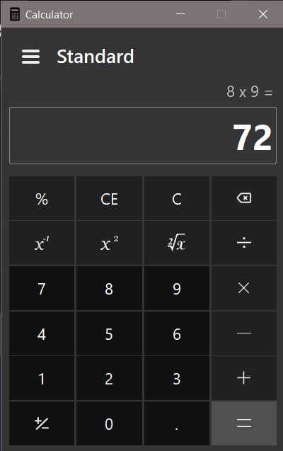
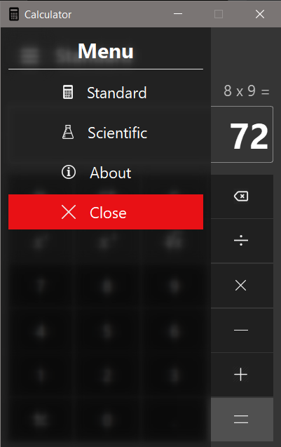

# SCIENTIFIC CALCULATOR

>Calculator app using PyQt5.
> 
>Inspired by [Patrick Attankurugu](https://github.com/PatrickAttankurugu/Scientific-Calculator).

## Screenshot
>*Current progress*

Standard screen

Side Menu

